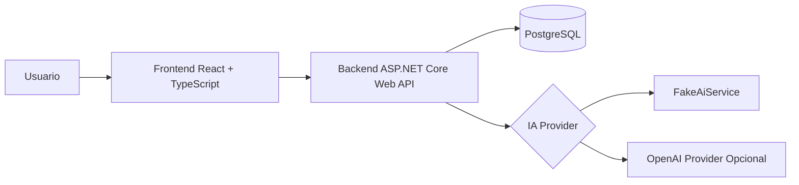
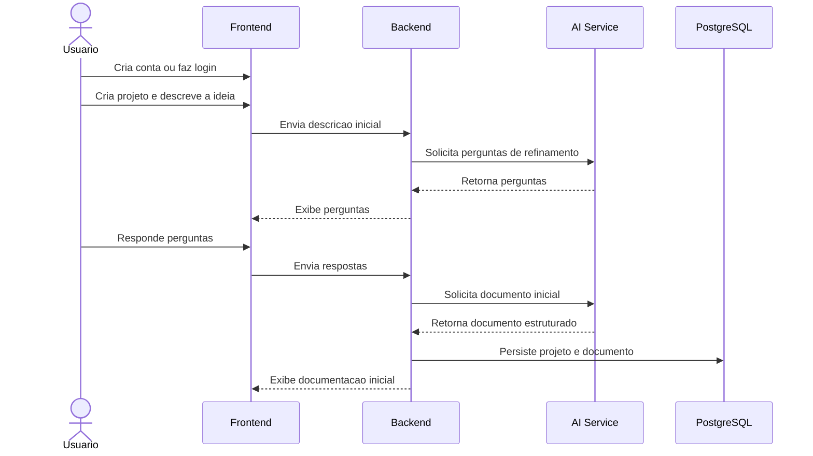

# SpecPilot AI

## Descricao do projeto

O **SpecPilot AI** e uma aplicacao web educacional focada em apoiar a fase inicial de especificacao de software. O usuario descreve a ideia de um sistema, recebe perguntas de refinamento geradas por IA, responde essas perguntas e, ao final, obtem uma documentacao tecnica inicial para orientar os primeiros passos do projeto.

Este repositorio foi preparado com foco didatico para uma pos-graduacao em IA Generativa. Nesta etapa, ele contem a base documental, a estrutura do projeto e os acordos de engenharia que orientarao a implementacao do MVP.

## Leitura rapida para a banca

Se esta for a primeira leitura do projeto, a sequencia recomendada e:

1. entender o problema e o objetivo neste README
2. consultar a arquitetura em `docs/03-architecture.md`
3. verificar o uso de IA em `docs/04-ai-usage.md`
4. revisar as ADRs em `docs/adr/`

## Problema

Muitas ideias de software comecam com descricoes vagas, incompletas ou ambiguas. Isso dificulta o alinhamento entre problema, requisitos, riscos e prioridades tecnicas.

Sem um processo de refinamento, e comum que:

- requisitos importantes fiquem ocultos
- restricoes nao sejam consideradas cedo
- a equipe comece a construir sem entendimento compartilhado
- a documentacao inicial fique inconsistente ou superficial

## Objetivo

Criar uma aplicacao simples que use IA Generativa para transformar uma ideia inicial em uma base de documentacao tecnica mais clara, objetiva e reaproveitavel.

## Escopo do MVP

O MVP permite:

- cadastro de usuario
- login simples
- criacao de projeto
- descricao inicial da ideia do sistema
- geracao de perguntas de refinamento com IA
- resposta das perguntas pelo usuario
- geracao de documento inicial com as secoes: visao geral, requisitos funcionais, requisitos nao funcionais, casos de uso e riscos

Fora do MVP:

- RAG
- upload de arquivos
- PDF
- chat livre
- microservicos
- Kafka
- RabbitMQ
- multiplos agentes
- integracao com GitHub
- geracao de codigo pelo sistema
- dashboard complexo
- colaboracao multiusuario

## Onde a IA e usada

A IA Generativa sera usada em dois momentos principais:

1. **Geracao de perguntas de refinamento**
   A partir da descricao inicial do usuario, o sistema produz perguntas para reduzir ambiguidades e levantar requisitos ausentes.

2. **Geracao do documento inicial**
   Com base na descricao inicial e nas respostas do refinamento, o sistema monta uma primeira versao estruturada da documentacao tecnica.

Por que usar IA aqui:

- acelerar a fase de descoberta
- melhorar a qualidade da especificacao inicial
- estimular pensamento estruturado
- apoiar usuarios que ainda nao dominam engenharia de requisitos

O projeto deve funcionar **sem chave externa** usando `FakeAiService`. O provider OpenAI sera opcional e controlado por variavel de ambiente.

O provider padrao continua sendo `Fake`, garantindo execucao local e testes sem dependencias externas. Quando desejado, a OpenAI pode ser habilitada por configuracao sem alterar a `Application`.

## O que esta pronto nesta etapa

Nesta fase, o repositorio entrega:

- documentacao funcional e arquitetural
- esqueleto inicial do backend em .NET 8
- esqueleto inicial do frontend em React + TypeScript
- prompts de runtime e de desenvolvimento assistido por IA
- ADRs iniciais
- configuracao base de ambiente com PostgreSQL e API via Docker Compose

Nesta fase, o repositorio ainda nao entrega:

- frontend funcional completo conectado a todo o fluxo do MVP
- integracao real com OpenAI

## Arquitetura prevista



## Fluxo principal do MVP



## Tecnologias previstas

- **Backend:** .NET 8, ASP.NET Core Web API
- **Frontend:** React + TypeScript
- **Banco de dados:** PostgreSQL
- **Containerizacao:** Docker e Docker Compose
- **Testes:** testes unitarios e de integracao
- **IA:** FakeAiService por padrao e OpenAI opcional

## Estrategia de testes

- **Testes unitarios:** validam regras de negocio, validacoes, mapeamentos e comportamentos isolados.
- **Testes de integracao:** validam endpoints, persistencia, fluxos principais e integracao com `FakeAiService`.
- **Objetivo didatico:** garantir confianca na evolucao do projeto sem depender de servicos externos.

Mais detalhes estao em [docs/08-testing-strategy.md](docs/08-testing-strategy.md).

## Decisoes de arquitetura

As principais decisoes foram registradas como ADRs:

- arquitetura monolitica modular
- PostgreSQL como banco relacional
- saida estruturada da IA
- prompts com metodo CO-STAR
- uso do Codex como agente de desenvolvimento assistido
- Docker Compose para ambiente local
- testes automatizados
- FakeAiService para execucao e testes sem dependencias externas

Veja [docs/adr](docs/adr).

## Como o avaliador executa com Docker Compose

O ambiente local foi preparado para ser iniciado com um unico comando. Nesta etapa, `docker compose up --build` deve subir:

- PostgreSQL
- API backend
- frontend React

No Linux ou macOS:

```bash
cp .env.example .env
docker compose up --build
```

No PowerShell:

```powershell
Copy-Item .env.example .env
docker compose up --build
```

Ao subir via Docker Compose, a API inicializa automaticamente o schema necessario do banco para o MVP atual.

## Enderecos esperados

- API: `http://localhost:8080`
- Frontend: `http://localhost:3000`
- Swagger: `http://localhost:8080/swagger`
- Health check: `http://localhost:8080/health`
- PostgreSQL: `localhost:5432`

## Variaveis de ambiente principais

O arquivo `.env.example` ja traz valores padrao para:

- banco PostgreSQL
- porta da API
- porta e base URL do frontend
- configuracao JWT basica
- `Ai__Provider=Fake`
- `Ai__OpenAi__ApiKey`
- `Ai__OpenAi__Model`

Isso permite subir o ambiente sem depender de chave externa de IA.

## Uso de IA Fake e OpenAI

Para execucao local e testes:

- mantenha `Ai__Provider=Fake`
- nao e necessario informar chave externa

Para habilitar OpenAI:

```text
Ai__Provider=OpenAI
Ai__OpenAi__ApiKey=sua-chave
Ai__OpenAi__Model=gpt-4.1-mini
```

Neste modo:

- a Infrastructure usa `HttpClient` direto contra a API da OpenAI
- os prompts de `prompts/runtime/` sao renderizados com placeholders
- o provider exige resposta em JSON estruturado
- a resposta e validada antes de seguir para a aplicacao

## Como encerrar o ambiente

```bash
docker compose down
```

Para remover tambem os volumes:

```bash
docker compose down -v
```

## Como rodar testes

Os testes atuais do backend podem ser executados localmente com:

```bash
dotnet test src/backend/SpecPilot.sln
```

Quando os testes de fluxo do MVP forem ampliados, o `FakeAiService` continuara sendo o comportamento padrao para garantir reprodutibilidade.

## Como rodar o frontend isoladamente

O frontend foi criado em `src/frontend/specpilot-web`.

No PowerShell:

```powershell
Set-Location src/frontend/specpilot-web
npm install
npm run dev
```

Por padrao, a aplicacao espera a API em `http://localhost:8080`.

## Como rodar testes do frontend

No PowerShell:

```powershell
Set-Location src/frontend/specpilot-web
npm test
```

Os testes usam Vitest + React Testing Library com ambiente `jsdom` e nao dependem de backend real.

## Integracao continua

O repositorio possui um workflow de GitHub Actions em `.github/workflows/ci.yml` para validar automaticamente backend e frontend em `push` e `pull_request`.

Essa pipeline executa:

- backend: restore, build e testes da solution em `src/backend`
- frontend: `npm ci`, `npm run build` e `npm test` em `src/frontend/specpilot-web`

No escopo atual, o CI:

- nao faz deploy
- nao publica imagens Docker
- nao usa segredos reais de OpenAI
- fixa `Ai__Provider=Fake` no job de backend para evitar chamadas reais ao provider externo

Isso reforca qualidade, confiabilidade e rastreabilidade do MVP sem aumentar escopo de infraestrutura.

## Prompts do projeto

O repositorio separa dois tipos de prompts:

- `prompts/runtime/`: prompts que a aplicacao usara em execucao
- `prompts/codex/`: prompts que documentam como a IA pode apoiar o desenvolvimento do projeto

Os prompts de runtime seguem CO-STAR e os prompts do Codex registram o processo de trabalho por etapa.

## Estrutura deste repositorio

```text
.
|-- README.md
|-- AGENTS.md
|-- .gitignore
|-- .env.example
|-- docker-compose.yml
|-- docs/
|   |-- adr/
|   `-- ...
|-- prompts/
|   |-- codex/
|   `-- runtime/
|-- src/
`-- tests/
```

## Leituras recomendadas dentro do repositorio

- [docs/00-project-overview.md](docs/00-project-overview.md)
- [docs/03-architecture.md](docs/03-architecture.md)
- [docs/04-ai-usage.md](docs/04-ai-usage.md)
- [docs/08-testing-strategy.md](docs/08-testing-strategy.md)
- [docs/12-docker-strategy.md](docs/12-docker-strategy.md)

## Documentacao complementar

- [docs/development-log.md](docs/development-log.md)

## Convencao de commits

Este projeto adota **Conventional Commits** para manter historico claro e consistente.

Exemplos:

- `docs: add initial project documentation`
- `docs: review initial documentation`
- `chore: add backend solution structure`
- `chore: add docker compose setup`
