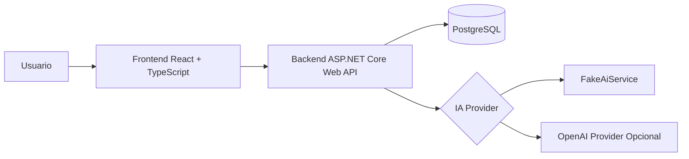

# SpecPilot AI

## Descricao do projeto

O **SpecPilot AI** e uma aplicacao web educacional focada em apoiar a fase inicial de especificacao de software. O usuario descreve a ideia de um sistema, recebe perguntas de refinamento geradas por IA, responde essas perguntas e, ao final, obtem uma documentacao tecnica inicial para orientar os primeiros passos do projeto.

Este repositorio foi preparado com foco didatico para uma pos-graduacao em IA Generativa. Nesta etapa, ele contem a base documental, a estrutura do projeto e os acordos de engenharia que orientarao a implementacao do MVP.

## Problema

Muitas ideias de software comecam com descricoes vagas, incompletas ou ambigueas. Isso dificulta o alinhamento entre problema, requisitos, riscos e prioridades tecnicas.

Sem um processo de refinamento, e comum que:

- requisitos importantes fiquem ocultos
- restricoes nao sejam consideradas cedo
- a equipe comece a construir sem entendimento compartilhado
- a documentacao inicial fique inconsistente ou superficial

## Objetivo

Criar uma aplicacao simples que use IA Generativa para transformar uma ideia inicial em uma base de documentacao tecnica mais clara, objetiva e reaproveitavel.

## Escopo do MVP

O MVP permite:

- cadastro de usuario
- login simples
- criacao de projeto
- descricao inicial da ideia do sistema
- geracao de perguntas de refinamento com IA
- resposta das perguntas pelo usuario
- geracao de documento inicial com:
  - visao geral
  - requisitos funcionais
  - requisitos nao funcionais
  - casos de uso
  - riscos

Fora do MVP:

- RAG
- upload de arquivos
- PDF
- chat livre
- microservicos
- Kafka
- RabbitMQ
- multiplos agentes
- integracao com GitHub
- geracao de codigo pelo sistema
- dashboard complexo
- colaboracao multiusuario

## Onde a IA e usada

A IA Generativa sera usada em dois momentos principais:

1. **Geracao de perguntas de refinamento**
   A partir da descricao inicial do usuario, o sistema produz perguntas para reduzir ambiguidades e levantar requisitos ausentes.

2. **Geracao do documento inicial**
   Com base na descricao inicial e nas respostas do refinamento, o sistema monta uma primeira versao estruturada da documentacao tecnica.

Por que usar IA aqui:

- acelerar a fase de descoberta
- melhorar a qualidade da especificacao inicial
- estimular pensamento estruturado
- apoiar usuarios que ainda nao dominam engenharia de requisitos

O projeto deve funcionar **sem chave externa** usando `FakeAiService`. O provider OpenAI sera opcional e controlado por variavel de ambiente.

## Arquitetura prevista



## Fluxo principal do MVP


## Tecnologias previstas

- **Backend:** .NET 8, ASP.NET Core Web API
- **Frontend:** React + TypeScript
- **Banco de dados:** PostgreSQL
- **Containerizacao:** Docker e Docker Compose
- **Testes:** testes unitarios e de integracao
- **IA:** FakeAiService por padrao e OpenAI opcional

## Estrategia de testes

- **Testes unitarios**
  Validam regras de negocio, validacoes, mapeamentos e comportamentos isolados.

- **Testes de integracao**
  Validam endpoints, persistencia, fluxos principais e integracao com `FakeAiService`.

- **Objetivo didatico**
  Garantir confianca na evolucao do projeto sem depender de servicos externos.

Mais detalhes estao em [docs/08-testing-strategy.md](/c:/Users/saulo/OneDrive/Desktop/PÓS IA/projectc4/docs/08-testing-strategy.md).

## Decisoes de arquitetura

As principais decisoes foram registradas como ADRs:

- arquitetura monolitica modular
- PostgreSQL como banco relacional
- saida estruturada da IA
- prompts com metodo CO-STAR
- uso do Codex como agente de desenvolvimento assistido
- Docker Compose para ambiente local
- testes automatizados
- FakeAiService para execucao e testes sem dependencias externas

Veja [docs/adr](/c:/Users/saulo/OneDrive/Desktop/PÓS IA/projectc4/docs/adr).

## Como o avaliador executa com Docker Compose

Nesta etapa, o repositorio ainda **nao implementa backend nem frontend**, por decisao de escopo. Mesmo assim, a base ja traz `docker-compose.yml` para preparar o ambiente local com PostgreSQL.

Passos:

```bash
cp .env.example .env
docker compose up -d
docker compose ps
```

Resultado esperado nesta fase:

- container do PostgreSQL em execucao
- volume persistente criado
- base preparada para a proxima etapa de implementacao

Para encerrar:

```bash
docker compose down
```

## Como rodar testes

Nesta etapa ainda nao existem projetos de teste implementados, porque o backend e o frontend ainda nao foram criados.

A estrategia definida para as proximas etapas e:

```bash
docker compose up -d
# backend
dotnet test
# frontend
npm test
```

Quando os testes forem implementados, o `FakeAiService` sera o comportamento padrao para garantir reprodutibilidade.

## Estrutura deste repositorio

```text
.
|-- README.md
|-- AGENTS.md
|-- .gitignore
|-- .env.example
|-- docker-compose.yml
|-- docs/
|   |-- adr/
|   `-- ...
`-- prompts/
    |-- codex/
    `-- runtime/
```

## Leituras recomendadas dentro do repositorio

- [docs/00-project-overview.md](/c:/Users/saulo/OneDrive/Desktop/PÓS IA/projectc4/docs/00-project-overview.md)
- [docs/03-architecture.md](/c:/Users/saulo/OneDrive/Desktop/PÓS IA/projectc4/docs/03-architecture.md)
- [docs/04-ai-usage.md](/c:/Users/saulo/OneDrive/Desktop/PÓS IA/projectc4/docs/04-ai-usage.md)
- [docs/08-testing-strategy.md](/c:/Users/saulo/OneDrive/Desktop/PÓS IA/projectc4/docs/08-testing-strategy.md)
- [docs/12-docker-strategy.md](/c:/Users/saulo/OneDrive/Desktop/PÓS IA/projectc4/docs/12-docker-strategy.md)

## Convencao de commits

Este projeto adota **Conventional Commits** para manter historico claro e consistente.

Exemplos:

- `docs: add initial project documentation`
- `feat: create backend project skeleton`
- `test: add integration tests for project workflow`

