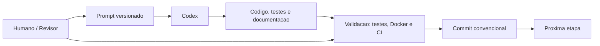
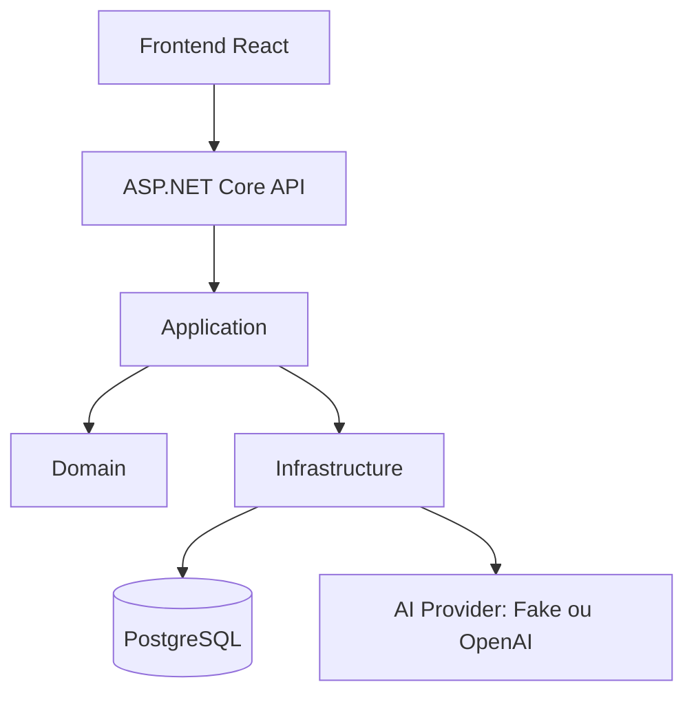
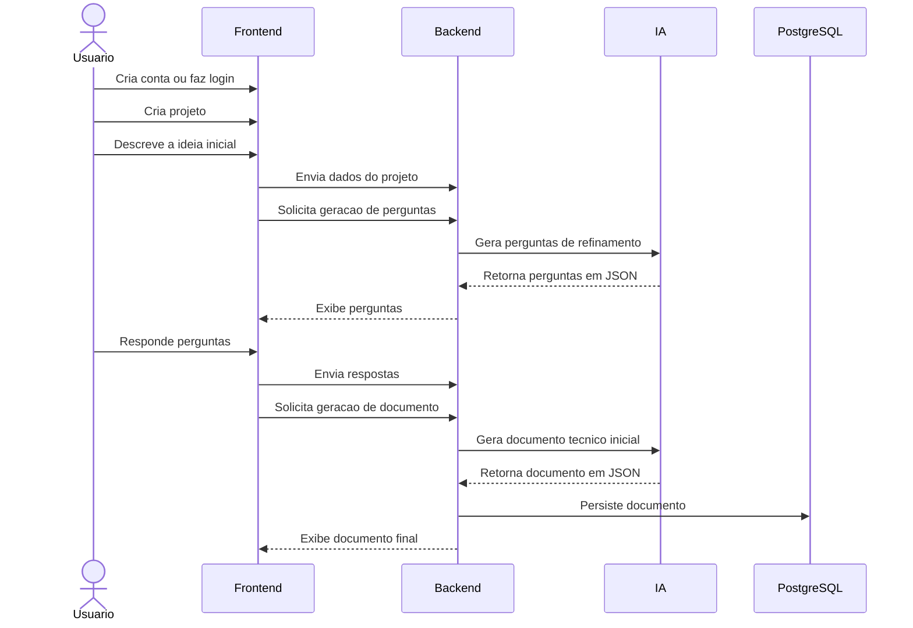
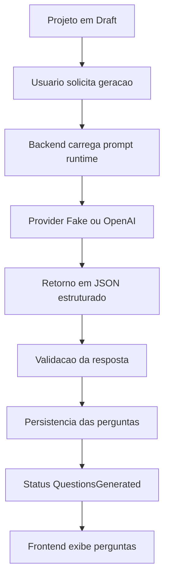
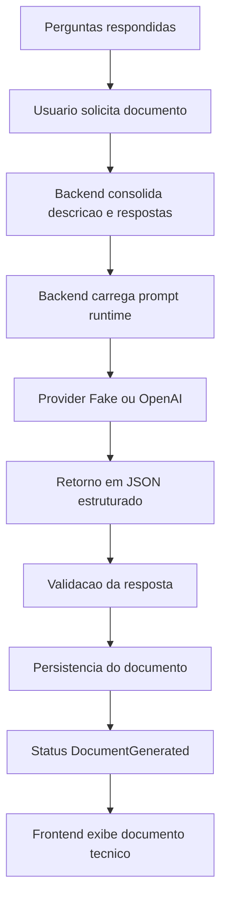

# SpecPilot AI

## Resumo

O SpecPilot AI e um MVP academico de apoio a especificacao inicial de software. A proposta do projeto e transformar uma ideia ainda vaga em um primeiro documento tecnico mais claro, usando IA Generativa de forma controlada, rastreavel e compatível com um processo de engenharia bem documentado.

## A historia do projeto

Muitas ideias de software nascem de uma conversa curta, de uma intuicao de produto ou de uma necessidade percebida no dia a dia. O problema e que, nesse momento inicial, quase nada costuma estar realmente claro. Quem sao os usuarios? O que entra na primeira versao? Quais riscos ja aparecem cedo? O que parece obvio para quem imaginou a solucao ainda nao esta organizado como requisito.

Em muitos cenarios, a documentacao inicial acaba sendo negligenciada. A equipe pula direto para a implementacao, os requisitos ficam incompletos, surgem contradicoes, o entendimento muda ao longo do caminho e o retrabalho aparece cedo. O que deveria ser uma etapa de alinhamento vira uma etapa improvisada.

O SpecPilot AI nasce exatamente nesse ponto. A ideia central do projeto e usar IA Generativa nao como um chat livre nem como um substituto do julgamento humano, mas como apoio estruturado para o refinamento inicial da ideia. Em vez de prometer automacao excessiva, o sistema conduz um fluxo pequeno, didatico e intencional: entender melhor a ideia, levantar perguntas uteis e consolidar um documento tecnico inicial.

## Problema

O projeto resolve um problema comum na fase inicial de ideacao de software: ideias vagas demais para virarem requisitos consistentes com seguranca. Sem uma etapa de refinamento, e facil iniciar implementacao cedo demais, com entendimento incompleto, documentacao fraca e pouca visibilidade de riscos.

## Objetivo academico

Este projeto foi desenvolvido como um MVP academico de pos-graduacao em IA Generativa. Por isso, ele busca demonstrar nao apenas uma funcionalidade com IA dentro do produto, mas tambem um processo de engenharia assistido por IA, com escopo controlado, documentacao versionada, testes, Docker, CI e revisao humana.

## O que o SpecPilot AI faz

O fluxo principal do produto e simples e direto:

1. o usuario cria conta;
2. cria um projeto;
3. descreve a ideia inicial;
4. a IA gera perguntas de refinamento;
5. o usuario responde essas perguntas;
6. a IA gera um documento tecnico inicial;
7. o usuario visualiza o resultado final.

Na pratica, isso permite sair de uma descricao ainda imprecisa para um artefato inicial com visao geral, requisitos funcionais, requisitos nao funcionais, casos de uso e riscos.

## Escopo do MVP

O que esta incluido:

- autenticacao;
- gerenciamento de projetos;
- geracao de perguntas de refinamento;
- resposta das perguntas;
- geracao de documento tecnico inicial;
- visualizacao do documento;
- Docker e Docker Compose;
- testes automatizados;
- CI com GitHub Actions;
- documentacao em `docs/`;
- prompts versionados em `prompts/runtime/` e `prompts/codex/`.

## Fora do escopo do MVP

O que ficou explicitamente fora desta etapa:

- RAG;
- upload de arquivos;
- exportacao PDF;
- chat livre;
- multiplos agentes;
- microservicos;
- Kafka ou RabbitMQ;
- deploy cloud;
- colaboracao multiusuario.

Esses itens ficaram fora de forma proposital para manter o MVP pequeno, testavel, bem documentado e coerente com os objetivos academicos do projeto.

## Duas dimensoes de uso de IA

O SpecPilot AI usa IA em duas dimensoes complementares:

1. IA dentro do produto.
2. IA durante o desenvolvimento.

Essa escolha foi proposital. O projeto nao quis demonstrar apenas uma funcionalidade com IA para o usuario final. Ele tambem quis demonstrar um processo de engenharia assistido por IA, com controle humano, rastreabilidade no repositorio e limitacao clara de escopo.

## IA dentro do produto

Dentro do produto, a IA aparece em dois momentos:

- geracao de perguntas de refinamento;
- geracao do documento tecnico inicial.

O fluxo foi desenhado para que o frontend nunca chame OpenAI diretamente. Toda integracao com IA fica centralizada no backend, atras de uma abstracao unica. Isso permite manter validacao, rastreabilidade, controle de provider e tratamento de falhas no lugar certo.

Pontos importantes desta camada:

- `FakeAiService` e o provider padrao;
- OpenAI e opcional via variavel de ambiente;
- os prompts de runtime ficam em `prompts/runtime/`;
- os prompts seguem o metodo CO-STAR;
- as respostas sao solicitadas em JSON estruturado;
- o backend valida o formato antes de seguir no fluxo;
- interacoes de IA podem ser registradas por meio de `AiInteractionLog`;
- a integracao real com OpenAI usa `HttpClient` apenas na camada de `Infrastructure`.

## Como a IA foi controlada dentro do produto

A IA dentro do produto nao foi tratada como uma caixa-preta sem governanca. O controle foi feito por varios mecanismos complementares:

- prompts estruturados em CO-STAR;
- exigencia de resposta em JSON estruturado;
- validacao do payload retornado;
- uso de `Result` e `Result<T>` para falhas esperadas;
- uso de `ProblemDetails` na representacao HTTP de erros;
- rastreabilidade de interacoes com IA em `AiInteractionLog`;
- `FakeAiService` como comportamento padrao para execucao local e testes;
- revisao humana das decisoes de arquitetura e escopo;
- documentacao das decisoes no repositorio.

Em outras palavras, a IA ajuda a produzir saidas uteis, mas o produto foi desenhado para controlar bem onde ela entra, o que ela deve retornar e como o sistema reage em caso de erro.

## IA no desenvolvimento: Codex, prompts e human-in-the-loop

O desenvolvimento do SpecPilot AI tambem usou IA de forma proposital e controlada. O Codex foi utilizado como agente auxiliar de desenvolvimento, mas nao como um sistema solto recebendo um unico prompt generico do tipo "crie tudo". O projeto foi dividido em pequenas etapas, cada uma com objetivo claro, escopo delimitado e validacoes concretas.

Cada etapa foi registrada em prompts sequenciais dentro de `prompts/codex/`. Esses prompts descreviam o contexto, o objetivo da etapa, tarefas, restricoes, criterios de aceite, comandos de validacao e ate a mensagem de commit esperada. Isso ajudou a transformar o desenvolvimento assistido por IA em um processo rastreavel, auditavel e reproduzivel.

O Codex era constantemente orientado a ler `README.md`, `AGENTS.md` e os documentos relevantes em `docs/` antes de alterar qualquer coisa. O [AGENTS.md](AGENTS.md) funcionou como guia de comportamento do agente, reforcando limites de escopo, exigencia de documentacao, foco didatico e respeito ao MVP. O [docs/development-log.md](docs/development-log.md) registrou marcos, problemas, retomadas de contexto e decisoes importantes ao longo do trabalho. As ADRs em [docs/adr](docs/adr) registraram as escolhas arquiteturais centrais.

O papel humano foi essencial durante todo o processo. O humano atuou como revisor, decisor e limitador de escopo. Decisoes relevantes como uso de Result Pattern, `ProblemDetails`, Docker Compose, GitHub Actions, protecao de `ProjectStatus`, estrategia de testes e limites do MVP foram validadas com revisao humana. A IA sugeria, implementava e validava; o humano revisava, aprovava, corrigia a direcao e controlava o que podia ou nao entrar.

O trabalho tambem contou, quando aplicavel, com skills e superpowers do ambiente de desenvolvimento. Elas funcionaram como apoio metodologico, nao como substitutas do julgamento humano. Entre os apoios usados ao longo das etapas:

- `brainstorming`, para estruturar abordagens antes de implementar;
- `systematic-debugging`, para investigar falhas reais, como o problema de `npm ci` e `package-lock` no CI;
- `test-driven-development`, quando aplicavel, especialmente em fluxos de backend e testes;
- `verification-before-completion`, para exigir validacao antes de concluir etapas.

Essa combinacao foi importante porque a memoria permanente do projeto nao ficou na conversa com a IA, e sim no proprio repositorio: prompts versionados, commits pequenos, development log, ADRs, testes, Docker e CI.



Essa abordagem foi usada para evitar:

- escopo descontrolado;
- decisoes nao documentadas;
- dependencia da memoria da conversa;
- codigo sem teste;
- entregas dificeis de reproduzir.

## Metodo CO-STAR

Os prompts de runtime usam o metodo CO-STAR para deixar a interacao com IA mais clara, consistente e auditavel.

- **Context**: em que contexto a IA esta operando.
- **Objective**: o que ela precisa produzir.
- **Style**: como a resposta deve ser estruturada.
- **Tone**: qual tom deve adotar.
- **Audience**: para quem a resposta foi pensada.
- **Response**: qual formato de saida deve ser retornado.

Os prompts podem ser consultados em [prompts/runtime](prompts/runtime).

## Arquitetura

O projeto adota uma arquitetura monolitica modular, com separacao clara entre frontend, API, aplicacao, dominio, infraestrutura, banco e provider de IA.



Mais detalhes estao em [docs/03-architecture.md](docs/03-architecture.md).

## Fluxo principal



## Fluxo de geracao de perguntas



## Fluxo de geracao de documento



## Tecnologias utilizadas

### Backend

- .NET 8
- ASP.NET Core Web API
- MediatR
- FluentValidation
- Entity Framework Core

### Frontend

- React
- TypeScript
- Vite
- React Router
- TanStack Query
- React Hook Form
- Zod

### IA

- `FakeAiService`
- OpenAI opcional
- prompts runtime em CO-STAR

### Banco

- PostgreSQL

### Infra

- Docker
- Docker Compose

### Testes

- xUnit no backend
- testes unitarios e de integracao no backend
- Vitest
- React Testing Library
- jsdom

### CI

- GitHub Actions

## Como executar com Docker Compose

Exemplo de fluxo local:

```bash
git clone <url-do-repositorio>
cd projectc4
cp .env.example .env
docker compose up --build
```

No PowerShell:

```powershell
git clone <url-do-repositorio>
Set-Location projectc4
Copy-Item .env.example .env
docker compose up --build
```

URLs esperadas:

- Frontend: `http://localhost:3000`
- API: `http://localhost:8080`
- Swagger: `http://localhost:8080/swagger`
- Health: `http://localhost:8080/health`

## Como executar sem Docker

O caminho recomendado para avaliacao continua sendo Docker Compose, porque ele concentra frontend, API e PostgreSQL com configuracao padrao reprodutivel.

Para rodar o frontend isoladamente, a documentacao atual ja cobre:

```powershell
Set-Location src/frontend/specpilot-web
npm install
npm run dev
```

Para o backend, o projeto da API fica em `src/backend/src/SpecPilot.Api` e pode ser executado localmente em ambiente .NET 8 quando necessario durante desenvolvimento. Ainda assim, para avaliacao do MVP, a recomendacao principal do repositorio continua sendo usar Docker Compose.

## Variaveis de ambiente

As variaveis principais incluem:

- `Ai__Provider=Fake`
- `Ai__OpenAi__ApiKey`
- `Ai__OpenAi__Model`
- configuracoes de JWT
- configuracoes do PostgreSQL
- `VITE_API_BASE_URL`

Exemplo de configuracao padrao:

```text
Ai__Provider=Fake
Ai__OpenAi__ApiKey=
Ai__OpenAi__Model=gpt-4.1-mini
VITE_API_BASE_URL=http://localhost:8080
```

Pontos importantes:

- OpenAI nao e obrigatoria;
- `FakeAiService` e o comportamento padrao;
- segredos nao devem ser versionados;
- a chave OpenAI nao deve ir para o frontend;
- o frontend nunca chama OpenAI diretamente.

Para habilitar OpenAI opcionalmente:

```text
Ai__Provider=OpenAI
Ai__OpenAi__ApiKey=sua-chave
Ai__OpenAi__Model=gpt-4.1-mini
```

## Como rodar os testes

Backend:

```bash
dotnet test src/backend/SpecPilot.sln
```

Frontend:

```powershell
Set-Location src/frontend/specpilot-web
npm ci
npm run build
npm test
```

## CI com GitHub Actions

O repositorio possui CI em `.github/workflows/ci.yml`.

O que ele valida:

- backend com restore, build e testes;
- frontend com `npm ci`, `npm run build` e `npm test`.

O que ele nao faz:

- nao faz deploy;
- nao publica imagens Docker;
- nao usa segredos reais de OpenAI;
- nao chama OpenAI real;
- fixa `Ai__Provider=Fake` no backend.

## Estrutura de pastas

```text
docs/
docs/adr/
prompts/runtime/
prompts/codex/
src/backend/
src/frontend/
tests/backend/
```

## Decisoes de arquitetura

Entre as principais decisoes registradas:

- backend como monolito em camadas;
- PostgreSQL como banco relacional;
- Result Pattern com `ProblemDetails`;
- Global Exception Handler;
- `FakeAiService` como provider padrao;
- `HttpClient` para o provider OpenAI;
- Docker Compose como setup principal;
- GitHub Actions para CI;
- protecao das transicoes de `ProjectStatus`;
- prompts runtime em CO-STAR;
- human-in-the-loop no processo de desenvolvimento.

As ADRs podem ser consultadas em [docs/adr](docs/adr).

## Boas praticas aplicadas

O projeto foi guiado por principios e praticas como:

- SOLID;
- DRY;
- KISS;
- YAGNI;
- Clean Code;
- validacao de entrada;
- testes automatizados;
- CI;
- separacao de responsabilidades;
- documentacao versionada;
- Conventional Commits;
- development log;
- ADRs.

Mais detalhes estao em [docs/13-development-best-practices.md](docs/13-development-best-practices.md).

## Seguranca basica

Entre os cuidados de seguranca presentes no projeto:

- autenticacao com JWT;
- rotas protegidas;
- isolamento de projetos por usuario autenticado;
- senha nao retornada pela API;
- chave OpenAI fora do frontend;
- frontend sem chamada direta para OpenAI;
- respostas de erro sem exposicao de stack trace ao usuario;
- `ProjectStatus` nao editavel manualmente no fluxo comum.

Mais detalhes estao em [docs/09-security.md](docs/09-security.md).

## Checklist de avaliacao

Para uma validacao objetiva do MVP, consulte:

- [docs/14-evaluation-checklist.md](docs/14-evaluation-checklist.md)

## Limitacoes conhecidas

Limitacoes reais desta etapa:

- sem RAG;
- sem upload de arquivos;
- sem exportacao PDF;
- sem chat livre;
- sem multiplos agentes;
- sem deploy cloud;
- sem colaboracao multiusuario;
- sem versionamento complexo de documentos;
- OpenAI opcional, com `FakeAiService` como padrao.

## Proximos passos

Possiveis evolucoes futuras:

- RAG;
- upload de documentos;
- exportacao PDF;
- versionamento de documentos;
- multiplos agentes especializados;
- Playwright E2E;
- deploy;
- observabilidade avancada.

## Leituras complementares

- [docs/00-project-overview.md](docs/00-project-overview.md)
- [docs/01-problem-statement.md](docs/01-problem-statement.md)
- [docs/03-architecture.md](docs/03-architecture.md)
- [docs/04-ai-usage.md](docs/04-ai-usage.md)
- [docs/05-prompts.md](docs/05-prompts.md)
- [docs/08-testing-strategy.md](docs/08-testing-strategy.md)
- [docs/10-setup-guide.md](docs/10-setup-guide.md)
- [docs/11-codex-development-process.md](docs/11-codex-development-process.md)
- [docs/12-docker-strategy.md](docs/12-docker-strategy.md)
- [docs/14-evaluation-checklist.md](docs/14-evaluation-checklist.md)
- [docs/development-log.md](docs/development-log.md)

## Conclusao

O SpecPilot AI demonstra uma aplicacao pratica de IA Generativa com controle, rastreabilidade e foco academico. O projeto mostra como usar IA dentro do produto de forma estruturada e como usar IA durante o desenvolvimento sem abrir mao de revisao humana, testes, Docker, CI, documentacao e disciplina de engenharia. O resultado final nao e apenas um MVP funcional, mas tambem um processo de desenvolvimento assistido por IA que permanece auditavel, reproduzivel e conscientemente limitado em escopo.
