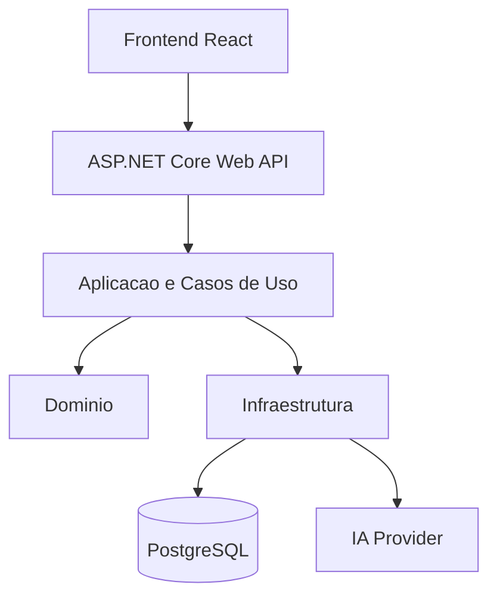

# 03 - Arquitetura proposta

## Estilo arquitetural

O projeto adotara uma **arquitetura monolitica modular**. Essa escolha favorece simplicidade operacional, menor custo cognitivo e boa adequacao ao escopo reduzido do MVP.

## Camadas previstas

### Frontend

Responsavel por:

- autenticacao do usuario
- criacao e consulta de projetos
- captura da ideia inicial
- exibicao das perguntas de refinamento
- envio das respostas
- exibicao do documento gerado

### Backend

Responsavel por:

- API HTTP
- autenticacao simples
- validacoes
- regras de negocio
- orquestracao do fluxo de IA
- persistencia

### Banco de dados

Responsavel por armazenar:

- usuarios
- projetos
- perguntas geradas
- respostas do usuario
- documentos gerados

### Servico de IA

Abstracao responsavel por:

- gerar perguntas de refinamento
- gerar documento inicial
- permitir troca entre `FakeAiService` e provider OpenAI

## Diagrama logico

## Principios arquiteturais

- baixo acoplamento
- alta coesao
- separacao de responsabilidades
- dependencia de abstracoes, nao de implementacoes concretas
- infraestrutura isolada das regras de negocio

