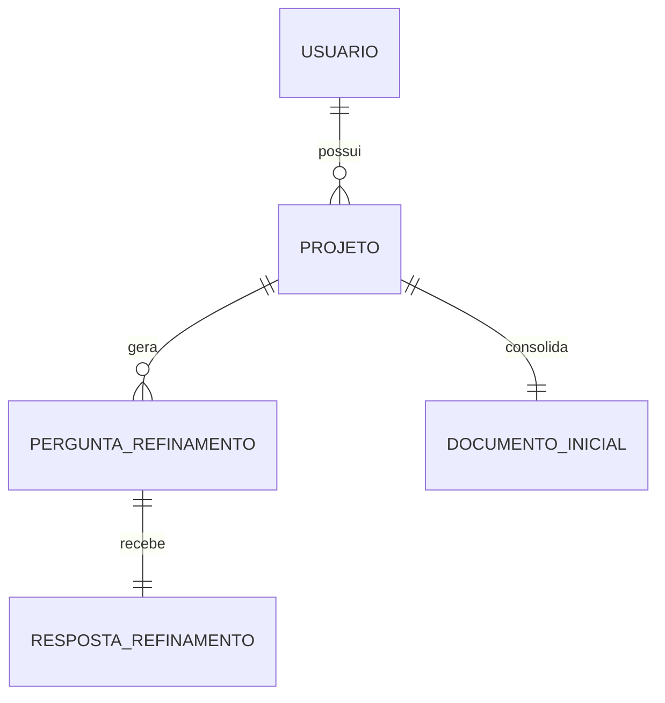

# 06 - Modelo de dados inicial

## Entidades principais do MVP

### Usuario

- `id`
- `nome`
- `email`
- `senhaHash`
- `criadoEm`

### Projeto

- `id`
- `usuarioId`
- `nome`
- `descricaoInicial`
- `status`
- `criadoEm`
- `atualizadoEm`

### PerguntaDeRefinamento

- `id`
- `projetoId`
- `ordem`
- `texto`
- `criadaEm`

### RespostaDeRefinamento

- `id`
- `perguntaId`
- `texto`
- `respondidaEm`

### DocumentoInicial

- `id`
- `projetoId`
- `visaoGeral`
- `requisitosFuncionais`
- `requisitosNaoFuncionais`
- `casosDeUso`
- `riscos`
- `geradoEm`

## Relacionamentos

## Observacoes

- o modelo e propositalmente pequeno
- nao ha versoes complexas de documento no MVP
- nao ha colaboracao multiusuario no mesmo projeto

